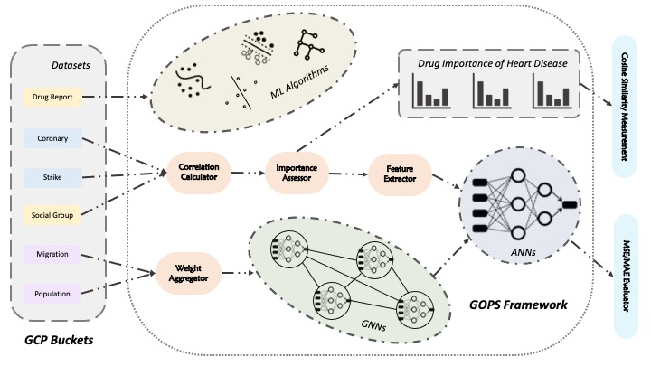

# GOPS: A Machine Learning Framework for Opioid Abuse Analysis

[![Code style: black][black-badge]][black-link]
[](#contributors-)



The project proposed a framework that integrates various machine learning models to predict and analyze this public safety problem, including to identify areas of high risk for future opioid outbreaks and to find out the relation to several common heart diseases. Through our work, we attempt to help governments and medical institution to identify possible strategies to address the opioid crisis.

## Features

- We use advanced machine learning models to make baseline predictions of the natural growth of different types of opioids.
- We find the groups who are susceptible to opioids in terms of socio-demography. By extracting strong relevance features, the number of opioids based on the composition of the society is predicted. Based on this, we enhance this model by taking the migration rate into consideration.
- We analyze the effects of different opioids on common heart diseases.

## File Structure

- assets: the assets we used for the paper and demo.

- prediction_linear_regression: county-level linear regression models to prediction the growth;

- prediction_socio_demo: important features extraction and several machine learning regression models that uses socio-demographic features;

- prediction_migriation: use GNNs to predict the opioids reports quantity that based on the civil migration rate;

- heart_disease_correlation: correlation analysis with coronary and stroke.

## Citation

## Citation:
To cite this repository:
```
@misc{erl,
  author = {Liu, Shuo and Li, Yu and Chen, Yujing},
  title = {{GOPS}: A Machine Learning Framework for Opioid Abuse Analysis},
  year = {2021},
  publisher = {GitHub},
  journal = {GitHub repository},
  howpublished = {\url{https://github.com/Sapphirine/202112-38-GOPS}},
}
```

## Talk

- 2021-12-22: [Analysis and Influence of Opioid Crisis
](https://youtu.be/xQCiBp78hCs)

[black-badge]:              https://img.shields.io/badge/code%20style-black-000000.svg
[black-link]:               https://github.com/psf/black